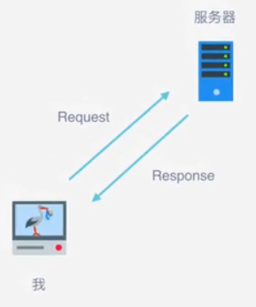
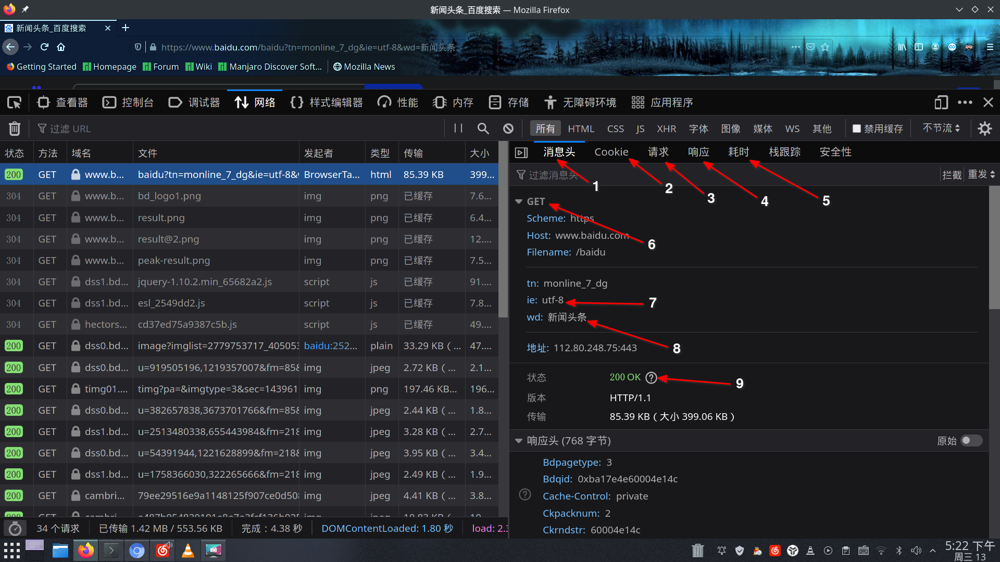

# Python3 爬虫学习笔记

[TOC]

## 环境配置

- Python 3.9
- PIP环境
```bash
sudo pacman -S python-pip
```
- MongoDB数据库

	由于官方软件仓库中不包含MongoDB的软件包，我们在这里使用的是AUR的软件包，关于软件包的具体信息可以在[Arch
	Wiki](https://wiki.archlinux.org/index.php/MongoDB_(%E7%AE%80%E4%BD%93%E4%B8%AD%E6%96%87))中进行查询，由于MongoDB的编译时间较长，我们在此选取MongoDB-bin$^{AUR}$进行安装：
	```
	yay -S mongodb-bin
	```
- Redis 环境
``` 
sudo pacman -S redis
```
- MySQL数据库
```
sudo pacman -S mysql
```
- 常用库的安装与配置
	不多逼逼，直接上命令：

	``` 
	pip install requests selenium beautifulsoup4 pyquery pymysql pymongo redis flask
	django jupyter
	```

## 爬虫的基本原理

### 基本概念

1. 爬虫是**请求**网站并**提取**数据的**自动化**程序。
2. 基本步骤

	2.1. 发送请求
	
	2.2. 获取相应内容

	2.3. 解析内容

	2.4. 保存数据

### 请求与响应

如图所示，主机首先向网址所在的服务器发送一个数据请求(Request)，服务器受到主机（浏览器）发送的消息后做相应的处理，再将相应的内容会传给浏览器，即Response。



#### Request 

1. 常用的几种类型：

|类型|说明|
|:--:|:--:|
|**GET**|将请求的参数加在url里面并返回实体主体，显示传输，适用于搜索引擎的关键词筛选|
|**POST**|将请求的参数包含在一个post表单，传输更具安全性|
|HEAD|之请求页面的首部|
|PUT|从客户端向服务器传送的数据取代制定的文档的内容|
|DELATE|请求服务器删除指定的页面|
|OPTIONS|允许客户端查看服务器的性能|

在上面的几种请求类型中，最常用的是标注为粗体的get和post请求，下面对百度中的get和post进行分析。

在浏览器中单击右键，点击**检查元素**选项，勾选“网络”选项（下图中1处），即可看到浏览器向服务器传送的所有请求。


图中2处为所使用的请求方法，点击请求后可以看到具体的请求内容：




